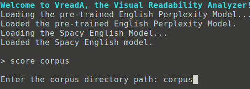
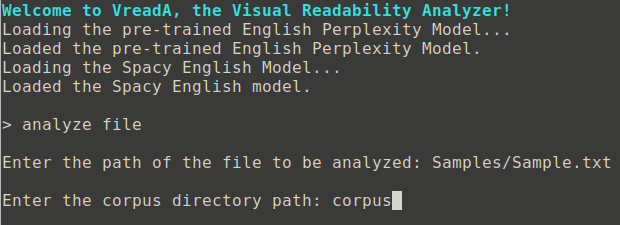
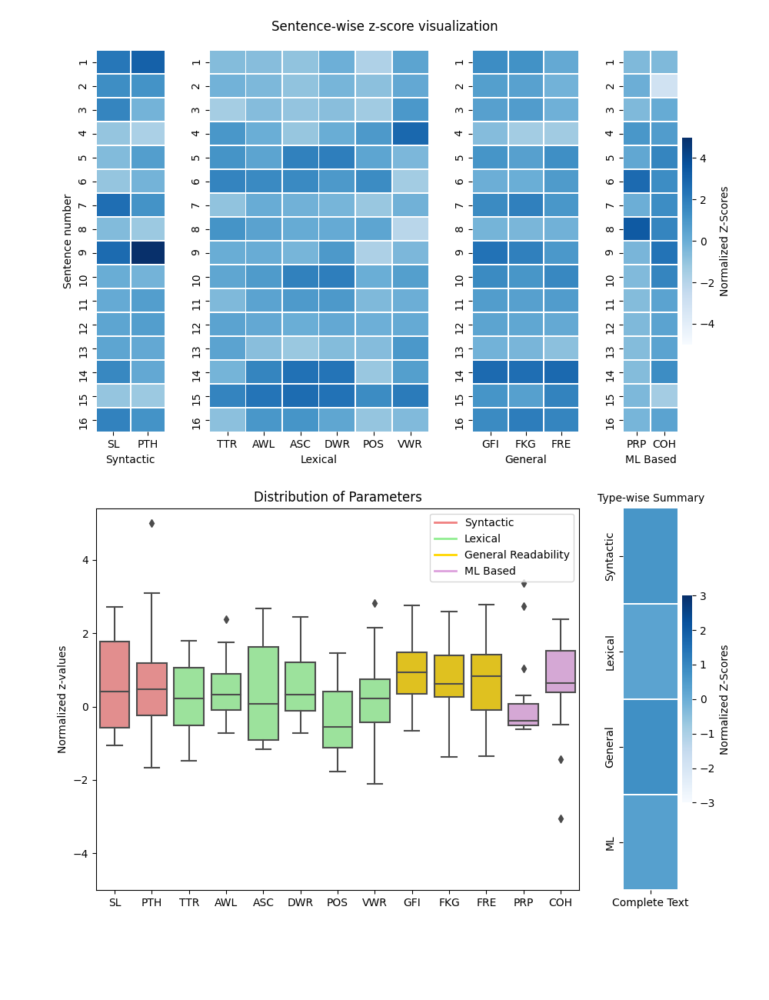

# VReadA: The Visual Readability Analyzer

## Installations
First install python3 and pip3 (python package installer) on your machine.
Then install the dependencies using the requirements.sh file by running 
  ```bash
bash requirements.txt
  ```

## Usage

After installing the dependencies, use the following command to start using VReadA

```bash
python3 launch.py
```

This will open a command line interface. 

For a corpus of papers, first we will calculate the statistics as benchmarks which will be used
for analyzing samples. To do so for a directory named corpus, we use the **score corpus** command.



Now, say we have to analyze a file Sample.txt present in the Samples folder, we can use the **analyze file** command.



After the above command executes, the text in the file Sample.txt is analyzed and rigourously checked on various parameters of readbility. The generated visualization looks like this:



